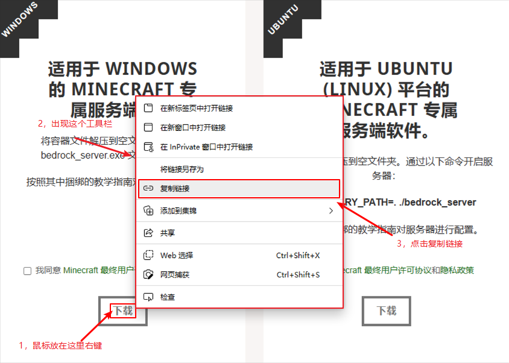
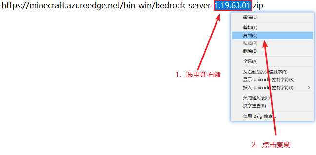
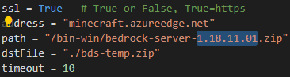

# Download bds wiki

### 什么是Download bds 
Download bds是一款由python编写的bds核心下载器   
此下载器是为了帮助bds整合包作者在不违反Mojang EULA的前提下制作整合包  

### Download bds的功能有什么
1.运行后出现“是否同意EULA协议（y/n）”，如果选择y继续运行，如果选择n则关闭程序  
2.选择后将自动下载bds服务端   
3.下载服务端后会自行运行LLPeEditor.exe     
最后停止运行

### 如何更改下载的版本
1.进入https://www.minecraft.net/zh-hans/download/server/bedrock  
2.鼠标放在"下载"上，点击鼠标右键，在出来的工具栏中点击"复制链接"   
   
3.将链接粘贴在记事本上查看版本号     
4.选中版本号并复制
  
5.打开Download bds.py    
6.将复制的版本号替换到此处   
  
7.保存并关闭，即可完成  

### 如何将.py转换为.exe可执行文件
1.此处使用的是pyinstaller将.py转换为.exe  
2.将build.bat和Download bds.py放在同一个文件夹内
3.双击运行build.bat即可自动下载pyinstaller并将.py转换为.exe   
4.转换完毕的文件在dist文件夹内  

### 如何使用
1.删除你的整合包内的bds核心   
2.将Download bds.exe放到整合包根目录     
3.双击运行即可下载核心   

### 注意
当您在使用LiteLoader 2.2.0及更老的版本时，需要更改以下代码  
将Download bds.py的59至61行的    
    print("Run SymDB2.exe")   
    print("运行SymDB2.exe中...")    
    os.system("SymDB2.exe")  
更改为     
    print("Run LLPeEditor.exe")     
    print("运行LLPeEditor.exe中...")      
    os.system("LLPeEditor.exe")
